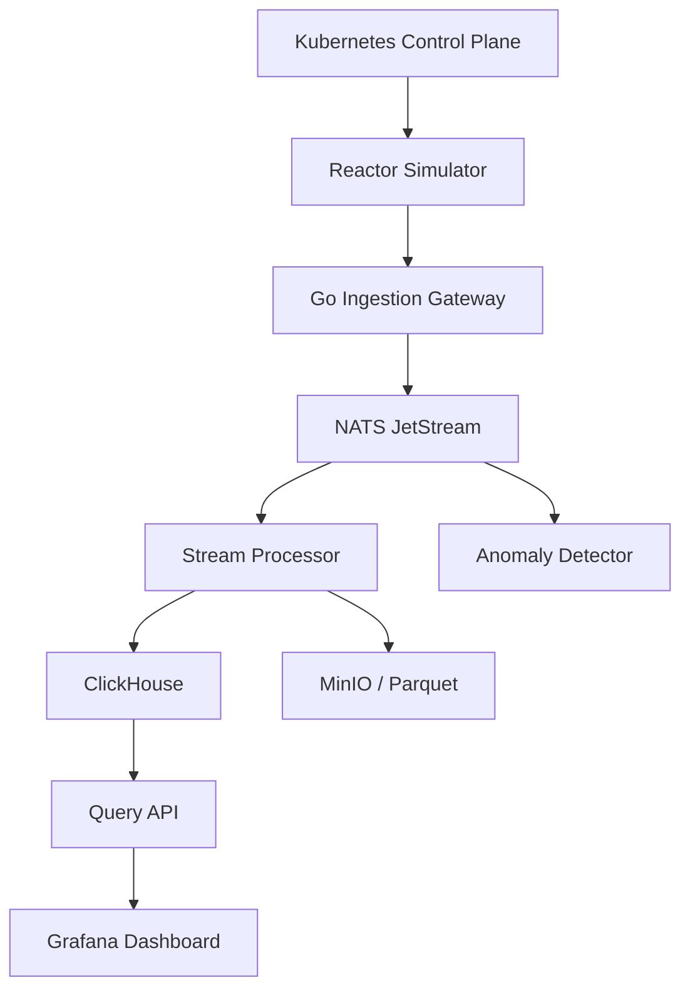

Build a **Fusion Telemetry Fabric**: a realistic distributed system that simulates reactor diagnostics, ingests the streams, detects anomalies, archives experimental shots, and deploys simulation jobs.

One correction: Go is strong for the surrounding data platform, but Kubernetes/Go should **not** run the reactor’s hard real-time safety loops. ITER separates central control from autonomous protection and safety systems, while EPICS commonly handles physical I/O and distributed scientific control. ITER expects roughly one million signals across its plant systems. [ITER CODAC](https://www.iter.org/machine/supporting-systems/codac), [EPICS architecture](https://docs.epics-controls.org/en/latest/getting-started/EPICS_Intro.html)

## System Architecture



## Technology Stack

| Component              | Choice                     |
| ---------------------- | -------------------------- |
| Services               | Go                         |
| Internal protocol      | Protobuf + gRPC            |
| Streaming              | NATS JetStream             |
| Analytics storage      | ClickHouse                 |
| Raw waveform storage   | MinIO with Parquet         |
| Metadata/configuration | PostgreSQL                 |
| Dashboard              | Grafana                    |
| Local deployment       | Docker Compose             |
| Distributed deployment | Kubernetes                 |
| Observability          | OpenTelemetry + Prometheus |
| Scientific analysis    | Python notebooks           |

NATS JetStream gives you persistence, replay, acknowledgements and at-least-once delivery without Kafka’s operational weight. [NATS JetStream documentation](https://docs.nats.io/nats-concepts/jetstream)

## Telemetry Model

Fusion data should be grouped around a reactor **shot**, pulse or discharge:

```protobuf
message TelemetryBatch {
  string machine_id = 1;
  string shot_id = 2;
  string diagnostic_id = 3;
  string channel_id = 4;

  int64 first_sample_time_ns = 5;
  uint64 sequence_number = 6;
  double sample_rate_hz = 7;

  string unit = 8;
  repeated double samples = 9;

  uint32 quality_flags = 10;
  string calibration_version = 11;
}
```

Batch waveform samples instead of creating one message per measurement. This is essential when magnetic and plasma diagnostics operate at high sampling rates.

## Services

### 1. Reactor Simulator

Generate synthetic signals for:

* plasma temperature
* magnetic-field probes
* plasma current
* density
* vacuum pressure
* neutron rate
* cooling-system temperature
* radiation monitors
* power-supply state

Support normal shots and injected failures:

```text
plasma disruption
sensor drift
dropped readings
magnet overheating
vacuum leak
clock skew
network interruption
```

### 2. Ingestion Gateway

Responsibilities:

* accept gRPC telemetry streams
* authenticate diagnostic devices
* validate schemas and units
* reject malformed batches
* detect missing sequence numbers
* add ingestion timestamps
* publish to NATS subjects

Example subjects:

```text
telemetry.machine-1.magnetics.probe-17
telemetry.machine-1.cooling.loop-3
telemetry.machine-1.radiation.monitor-2
events.machine-1.shot-started
events.machine-1.shot-ended
```

### 3. Stream Processor

* normalize units
* apply calibration versions
* compute rolling averages
* downsample high-frequency signals
* calculate min/max/mean/RMS
* assign quality flags
* write aggregates to ClickHouse
* archive raw batches to MinIO

Make processing idempotent because JetStream can redeliver unacknowledged messages.

### 4. Anomaly Detector

Start with engineering rules, not machine learning:

```text
temperature > safety threshold
rate of change exceeds threshold
sensor disagrees with neighboring sensors
sequence gap detected
signal becomes stuck
radiation rises while plasma power falls
```

Publish anomalies back to:

```text
alerts.machine-1.warning
alerts.machine-1.critical
```

Later add Isolation Forests, forecasting or learned disruption prediction in Python.

### 5. Query API

```http
GET /api/machines
GET /api/shots
GET /api/shots/{shotId}
GET /api/shots/{shotId}/signals
GET /api/channels/{channelId}/samples
GET /api/anomalies?shotId=...
POST /api/simulations
```

Queries should support signal, shot, timestamp range and downsampling interval.

### 6. Simulation Control Plane

Use a Go Kubernetes operator or controller to:

* launch simulated reactor experiments as Kubernetes Jobs
* select simulation parameters
* allocate CPU/memory
* track job status
* cancel experiments
* collect output artifacts
* retry failed jobs

Define a custom resource later:

```yaml
apiVersion: fusion.example/v1
kind: PlasmaSimulation
spec:
  model: synthetic-tokamak
  durationSeconds: 30
  sensorCount: 5000
  sampleRateHz: 20
  anomalyProfile: disruption
```

## Build Order

1. **Week 1:** Simulator producing 1,000 synthetic channels.
2. **Week 2:** Go ingestion gateway and NATS JetStream.
3. **Week 3:** ClickHouse writer and shot query API.
4. **Week 4:** Grafana shot and anomaly dashboards.
5. **Week 5:** Backpressure, deduplication and replay.
6. **Week 6:** Kubernetes deployment and simulation jobs.
7. **Week 7:** Failure injection and load testing.
8. **Week 8:** EPICS-compatible adapter and documentation.

## Performance Targets

Start with measurable objectives:

```text
5,000 simulated channels
100,000 scalar samples/second
p99 ingestion latency under 100 ms
no acknowledged data lost
successful replay after processor failure
30-second stream outage tolerated
horizontal scaling to three ingestion replicas
```

## Repository Structure

```text
fusion-telemetry/
├── cmd/
│   ├── simulator/
│   ├── ingest-gateway/
│   ├── stream-processor/
│   ├── anomaly-detector/
│   └── query-api/
├── internal/
│   ├── telemetry/
│   ├── streaming/
│   ├── storage/
│   └── diagnostics/
├── proto/
├── deployments/
│   ├── compose/
│   └── kubernetes/
├── load-tests/
└── dashboards/
```

Your first deliverable should be:

> Generate one synthetic 30-second plasma shot, stream 100,000 samples per second through Go and NATS, archive it, deliberately crash the processor, replay the missed telemetry, and visualize the complete shot.

That demonstrates Go concurrency, streaming semantics, failure recovery, time-series data, observability and Kubernetes without pretending Kubernetes is the reactor’s safety controller.
